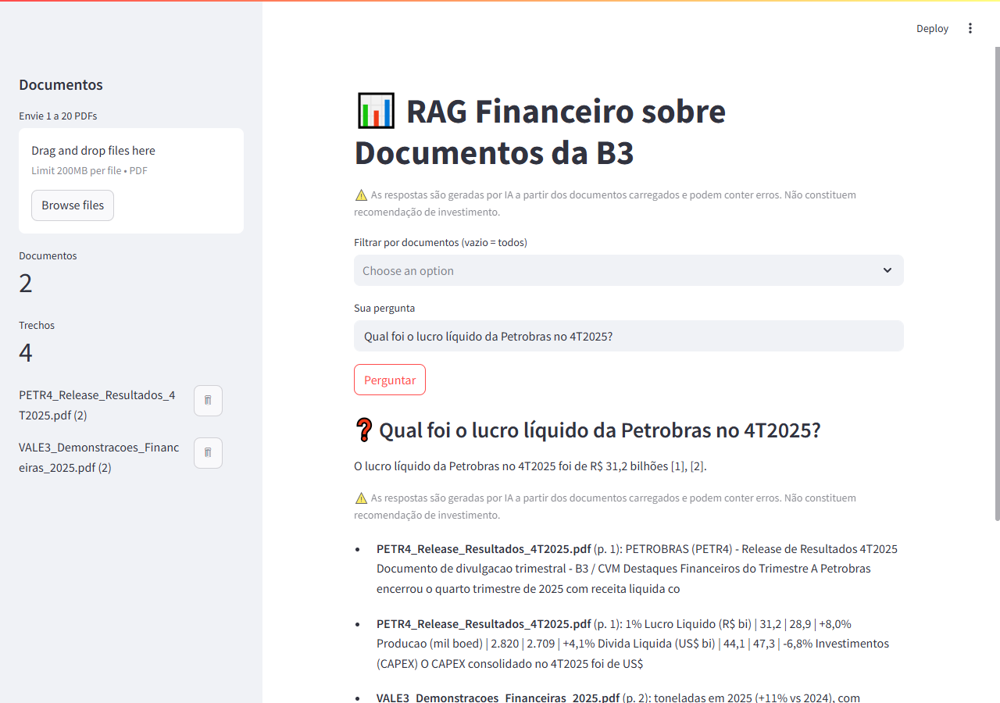

# RAG Financeiro sobre Documentos da B3

Agente de perguntas e respostas (RAG) sobre documentos financeiros da B3 (relatórios,
demonstrações, fatos relevantes em PDF). O usuário envia PDFs, faz perguntas em linguagem
natural e recebe respostas **fundamentadas exclusivamente nos trechos recuperados**, com
**citações** (documento + página) para conferência. Resolve o problema de localizar e
sintetizar informação dispersa em documentos longos, sem inventar dados fora das fontes.

## Demo

<!-- TODO: substitua pelo seu screenshot/GIF da aplicação rodando -->
<!-- Sugestão: grave um GIF curto subindo um PDF e fazendo uma pergunta. -->


> _Substitua `docs/demo.png` por um screenshot ou GIF real da aplicação._

## Arquitetura

Pipeline em camadas (`core/`): ingestão de PDF → chunking → embeddings → vector store →
retrieval (denso + BM25 com fusão RRF) → reranking opcional → geração com LLM → avaliação.
A UI é feita em Streamlit (`app.py`).

## Decisões de arquitetura

As escolhas abaixo foram deliberadas — refletem tradeoffs, não apenas o "caminho feliz":

- **Retrieval híbrido (denso + BM25 + RRF).** Embeddings capturam semântica; BM25 acerta termos exatos (tickers, valores, datas). A fusão por Reciprocal Rank Fusion combina os dois sem precisar calibrar pesos, melhorando o recall em consultas financeiras.
- **Reranking opcional e desligado por padrão.** O cross-encoder aumenta a precisão, mas é caro em CPU. Mantê-lo *off* preserva a portabilidade do deploy gratuito; a GPU é aproveitada só no desenvolvimento (`DEVICE=auto`). Em falha de carga/execução, cai para o retrieval base **sem quebrar a consulta**.
- **LLM tratado como dependência falível.** Timeout e rate limit (429) são mapeados para estados explícitos (`unavailable`, `rate_limited`), nunca propagam exceção crua nem vazam a `api_key` em mensagens.
- **Respostas sempre fundamentadas e com citação.** Sem contexto recuperado, o LLM **não é chamado** e a resposta é "informação insuficiente" — evita alucinação por construção.
- **Testabilidade offline.** *Fakes* determinísticos (`FakeLLM`, `HashEmbeddings`, `InMemoryVectorStore`, `FakeCrossEncoder`) permitem rodar toda a suíte no CI sem rede nem custo de API; os modelos reais ficam em testes `@pytest.mark.slow`, fora do CI.
- **Vector store plugável.** Chroma persistente por padrão, com `InMemoryVectorStore` para testes e `FaissVectorStore` como alternativa trocável por uma linha na fábrica.

## Requisitos

- Python 3.12+
- Pelo menos uma chave de LLM: **Groq** ou **Gemini**

## Instalação local (Windows / Linux)

```bash
python -m venv .venv
# Windows:
.venv\Scripts\activate
# Linux/macOS:
source .venv/bin/activate

pip install -r requirements.txt
```

## Configuração

Forneça as credenciais por variáveis de ambiente (`.env`) **ou** por `st.secrets`
(`.streamlit/secrets.toml`). A precedência é **env > secrets**.

```bash
cp .env.example .env                                  # e preencha as chaves
# ou, para Streamlit Cloud:
cp .streamlit/secrets.toml.example .streamlit/secrets.toml
```

Os arquivos reais (`.env`, `.streamlit/secrets.toml`) já estão no `.gitignore` e não devem
ser versionados. As variáveis de chunking, `TOP_K` e reranking são opcionais e usam padrões
seguros quando ausentes.

## Execução

```bash
streamlit run app.py
```

Envie de 1 a 20 PDFs pela barra lateral, clique em **Indexar** e faça perguntas. Use o
filtro de documentos para restringir a busca a um subconjunto (vazio = todos).

## Avaliação

Há um dataset de exemplo em `data/eval/dataset.json` (campos: `question`,
`reference_answer` e o opcional `expected_context`). Ele alimenta as métricas de Context
Precision, Faithfulness e Response Relevancy do `Evaluation_Module`.

## Deploy gratuito (Streamlit Community Cloud)

1. Faça o push do repositório para o GitHub.
2. Crie o app apontando para `app.py`.
3. Configure as credenciais em **Settings → Secrets** (mesmo formato de
   `secrets.toml.example`).

O workaround de `pysqlite3` no topo de `app.py` garante o funcionamento do Chroma no
ambiente do Streamlit Cloud. **Atenção:** o filesystem do Streamlit Cloud é **efêmero** —
documentos indexados em `data/chroma/` são perdidos a cada reinício; reindexe após o deploy.

## Trade-off Chroma × Faiss

O runtime usa **Chroma** persistente por padrão. Caso o Chroma apresente problemas no
ambiente de deploy, o design prevê um `FaissVectorStore` alternativo (mesma interface
`VectorStore`), trocável na fábrica em `core/pipeline.py` por uma linha.

## Reranking opcional (desligado por padrão)

O reranking por cross-encoder (`BAAI/bge-reranker-v2-m3`) é **opcional e desativado por
padrão** (`RERANK_ENABLED=false`) para preservar a portabilidade do deploy gratuito em CPU.
Em desenvolvimento com GPU, use `DEVICE=auto` para aproveitá-la. Se o reranker falhar ao
carregar/executar, a consulta cai automaticamente para o retrieval base, sem erro.

## Testes

```bash
pytest -m "not slow"     # suíte de CI (offline, com fakes determinísticos)
pytest                   # inclui testes lentos com modelos reais e Chroma persistente
black --check . && flake8 .
```
